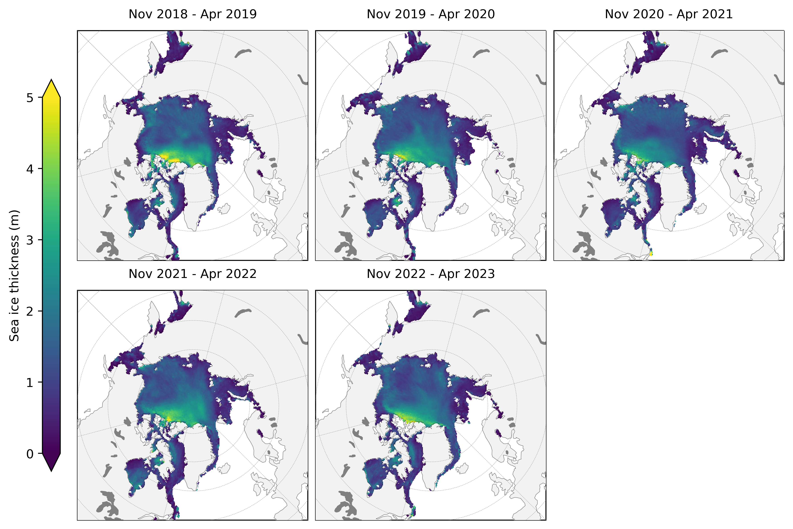
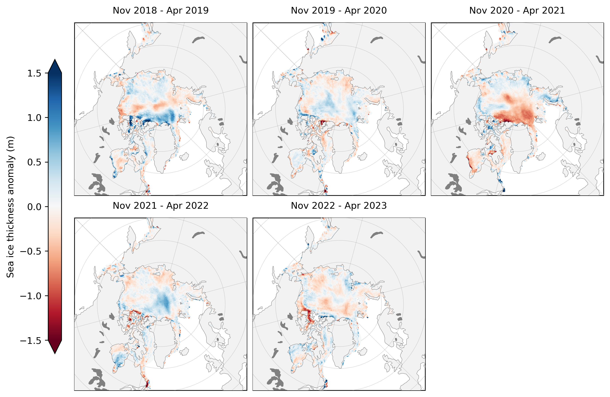

ICESat-2 Arctic Sea Ice State Analysis
============================================= 

NASA's Ice, Cloud, and Land Elevation Satellite-2 ([ICESat-2](https://icesat-2.gsfc.nasa.gov/)) is an advanced satellite laser altimetry system specially designed to profile Earth's fast-changing polar regions. The combination of meter-scale horizontal resolution and centimeter-scale vertical precision, makes ICESat-2 extremely well suited for measuring the thickness of polar sea ice - ice that forms and floats on top of the Arctic and Southern Ocean. In this Jupyter Book we provide a top-level analysis of winter Arctic sea ice thickness variability derived from ICESat-2 freeboards and NESOSIM snow loading since its launch in fall 2018.

Fig 1: Mean winter(November to April) Arctic sea ice thickness from the first five winters profiled by ICESat-2 (data from the monthly gridded IS2SITMOGR4 dataset).

Fig 2: Mean winter(November to April) Arctic sea ice thickness anomalies (relative to the five winter mean) from the first five winters profiled by ICESat-2.

## Background 

The ICESat-2 Project Science Office has produced and disseminated a number of official data products through the National Snow and Ice Data Center [(NSIDC)](https://nsidc.org/data/icesat-2) including the Arctic and Southern Ocean sea ice freeboard dataset [(ATL10)](https://nsidc.org/data/ATL10), which provides along-track estimates of the extension of sea ice above the local sea surface for each of the six beams of ICESat-2. 

Using assumptions regarding the depth and density of the snow layer on top of the ice, along with estimates of the density of the sea ice itself,  ICESat-2 freeboard data (ATL10) can be converted to an estimate of sea ice thickness. Estimates of Winter Arctic sea ice thickness using snow loading from the NASA Eulerian Snow on Sea Ice Model [(NESOSIM)](https://github.com/akpetty/NESOSIM) have been produced and disseminated through the NSIDC (https://nsidc.org/data/IS2SITMOGR4). More information about the methodology behind this dataset can be found in our [original methodology paper](http://www.alekpetty.com/papers/petty2020). A new manuscript has recently been publishedregarding the [analysis of the first three winters of data collected](https://tc.copernicus.org/articles/17/127/2023/), which was the original motivation behind the creation of this Jupyter Book.

Our goal going forward is to continue to update this book as new data is produced and to share additional analyses of the sea ice state using data collected by ICESat-2. The analysis presented here has focussed on the Arctic only to-date, due mainly to our increased confidence regarding snow on sea ice conditions compared to the Southern Ocean. Similarly, we currently do not produce any thickness estimates during summer as melt ponds complicate our retrievals of freeboard and simulations of snow depth. However, do continue to watch this space for futher updates as we learn more about the data from this relatively new mission and further its capabilities. 

## Using the book
There are three different ways to use this Jupyter Book:
 1. View the rendered Jupyter Notebooks by clicking through the links on the left. Note that there is no interactivity with this option.
 2. Run the Notebooks interactively in Binder. Just click the **Binder** tab under the rocket ship icon at the top of each Notebook. This option is configured for all notebooks except the modules in the Helper Functions section and the Data Wrangling notebook. 
 3. Clone (or fork then clone) the GitHub repository and run the Jupyter Notebooks locally. Just click the **repository** tab under the GitHub icon at the top of this page. 

## Navigation
- See the [ICESat-2 L4 Monthly Gridded Sea Ice Thickness Dataset (IS2SITMOGR4) notebook](https://www.icesat-2-sea-ice-state.info/content/1_is2sitmogr4_intro.html) for an introduction to the monthly gridded winter Arctic sea ice thickness dataset.
- Check out the notebooks in the chapter: WINTER ARCTIC SEA ICE THICKNESS ANALYSIS (PETTY ET AL., 2023) for the peer-reviewed analysis of winter Arctic sea ice conditions from 2018 to 2021, including comparisons with BGEP, CryoSat-2 and PIOMAS data.
- See the [2021-2022 winter analysis notebook](https://www.icesat-2-sea-ice-state.info/content/2b_winter_arctic_sea_ice_variability_2022update.html) and [most recent 2022-2023 winter analysis notebook](https://www.icesat-2-sea-ice-state.info/content/2b_winter_arctic_sea_ice_variability_2022update.html) to see the analysis updated to include the more recent winter periods. 
- Continue to watch this space for more sea ice analyses from ICESat-2!

## Jupyter Book description
[Jupyter Books](https://jupyterbook.org/intro.html) provide a novel means of compiling various related Jupyter Notebooks into one convenient and well-indexed location. Here, a series of Jupyter Notebooks are used to provide a visual demonstration of our efforts to analyze winter Arctic sea ice conditions, primiarly freeboard and thickness, derived from ICESat-2 data, along with other relevant datasets.

## Accessing the data 
The monthly gridded ICESat-2 winter Arctic sea ice thickness data are archived and made publicly available at the NSIDC (https://nsidc.org/data/IS2SITMOGR4). However, to simplify our analysis we have also uploaded these same data to an [AWS S3 Bucket](https://icesat-2-sea-ice-us-west-2.s3.us-west-2.amazonaws.com). In this first release of this Jupyter Book we also generated and uploaded aggregated netcdf files containing all the data needed for the original analysis in an S3 bucket under the name `IS2_jbook_dataset_201811-202104.nc` and `IS2_CS2_jbook_dataset_201811-202104.nc`. These datasets contains all the gridded ICESat-2 sea ice thickness data along with all other datasets used in the notebook to help contextualize the sea ice and atmospheric conditions through each winter. All datasets included have been regridded to the same NSIDC North Polar Stereographic grid (the native grid of the ICESat-2 sea ice data used), to simplify the mapping and comparisons. See the Data Wrangling pages for more information each dataset and on on the regridding process.

## Packages 
All of the notebooks in this notebook utilize [xarray](http://xarray.pydata.org/en/stable/), a python package built for working with multi-dimensional data like the monthly gridded sea ice data. Xarray is especially useful for time series data and allows for easily plotting data on map projections via compatability with the python packages cartopy and hvplot. 

## License

All content in this Jupyter Book is distributed under the MIT license.  

## Versions

Version 1.2 (11/27/2023):
 - Added the new 2022-2023 winter analysis notebook which also describes the new Version 3 IS2SITMOGR4 dataset.
 - A few other little minor bug fixes.
 
 Version 1.1 (01/27/2023):
 - Added the new 2021-2022 winter analysis notebook.
 - A few other little minor bug fixes.

Version 1.0 (12/23/2023): 
 - First full release associated with release of the TC paper (Petty et al., 2023). 
 - Tagged/archived on Zenodo:https://zenodo.org/record/7474218.

## Contributors

**Alek Petty (Current book lead, summer 2022 onwards)** 
 

**Nicole Keeney (Original book creator)** 

<!-- <iframe src="/flowers.html"
    width="100%"
    allow="encrypted-media"
    frameborder="0"
    >
</iframe> -->

## References

Petty A. A., N. Keeney, A. Cabaj, P. Kushner, M. Bagnardi (2023), Winter Arctic sea ice thickness from ICESat-2: upgrades to freeboard and snow loading estimates and an assessment of the first three winters of data collection, The Cryosphere, 17, 127–156, doi: 10.5194/tc-17-127-2023

Petty, A. A., N. T. Kurtz, R. Kwok, T. Markus, T. A. Neumann (2020), Winter Arctic sea ice thickness from ICESat‐2 freeboards, Journal of Geophysical Research: Oceans, 125, e2019JC015764. doi:10.1029/2019JC015764

 
